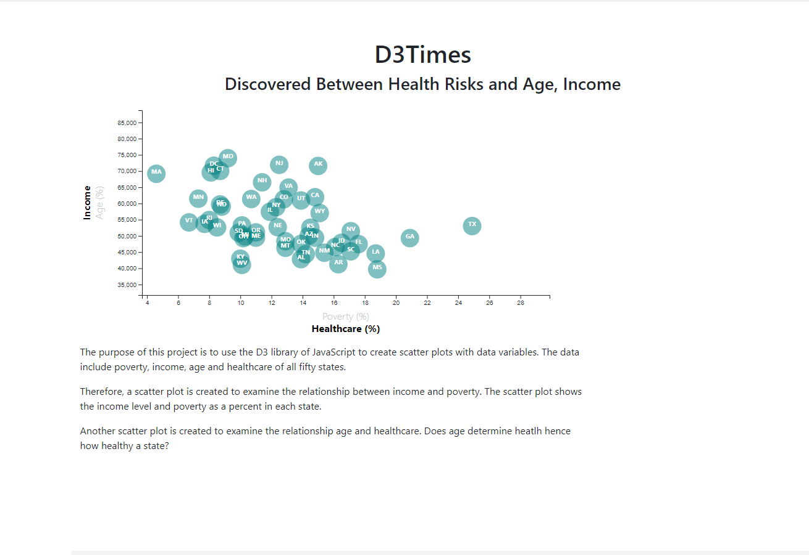

# What Factors Impact Health

  The purpose of this assignment was to use the D3 library of JavaScript to visualize the health risk each U.S. state faced.  Thus an interactive scatter plot chart was created. 
  

  
  
  The interactive plot is located at https://sj429.github.io/HealthRiskWithD3/
  
  
  The data set included with the assignment was based on 2014 ACS 1-year estimates: https://factfinder.census.gov/faces/nav/jsf/pages/searchresults.xhtml
    

